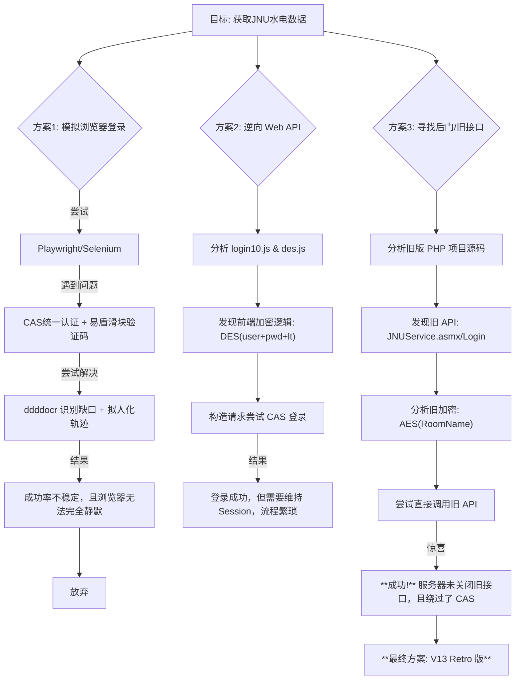

# 暨南大学宿舍水电费查询工具 (JNU IBS Query Tool)

这是一个基于 Python 的桌面应用程序，用于查询暨南大学番禺校区宿舍的水电费余额、详细用量及补贴情况。

本项目通过逆向分析学校老旧 API 接口，成功绕过了 CAS 统一身份认证和复杂的滑块验证码，实现了**零配置、免登录、极速查询**。

## ✨ 功能特点

*   **无需登录**：只需输入房间号（如 T8201），无需学号密码，保护隐私。
*   **极速响应**：直接调用后端 API，毫秒级返回数据。
*   **详细数据**：显示电费、冷水、热水的剩余量、已用量、补贴余额及单价。
*   **跨平台核心**：核心代码仅依赖 `requests` 和 `AES` 加密，易于移植到 Android/iOS。

## 🧠 逆向分析与开发历程

本项目经历了一系列的技术探索与试错，最终找到了最优解。以下是我们的思维导图：



## 🛠️ 技术栈

*   **语言**: Python 3.9+
*   **UI 框架**: Tkinter (内置，轻量级)
*   **网络请求**: Requests
*   **加密算法**: AES (ECB/CBC Mode) - `pycryptodome`
*   **打包工具**: PyInstaller

## 🚀 快速开始

### 1. 运行可执行文件 (Windows)

直接下载 [Releases](https://github.com/glasses666/JNU-IBS-Windows-Client/releases) 中的 `.exe` 文件运行即可。

### 2. 源码运行

```bash
# 克隆仓库
git clone https://github.com/glasses666/JNU-IBS-Windows-Client.git
cd JNU-IBS-Windows-Client

# 安装依赖
pip install -r requirements.txt

# 运行
python main.py
```

## 📂 文件结构

*   `main.py`: 主程序入口，包含 UI 和 核心 API 逻辑。
*   `js/`: (归档) 逆向过程中分析的学校网站 JavaScript 源码。
*   `requirements.txt`: Python 依赖库。

## ⚠️ 免责声明

本项目仅供学习交流使用，旨在研究网络协议与数据安全。
请勿将本项目用于任何商业用途或恶意攻击学校服务器。
使用本工具产生的一切后果由用户自行承担。
